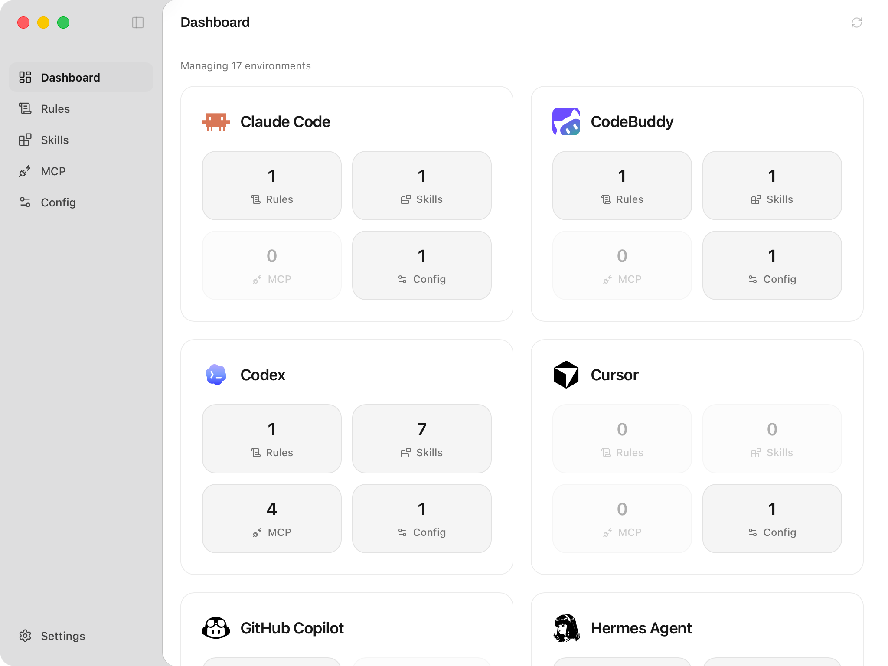
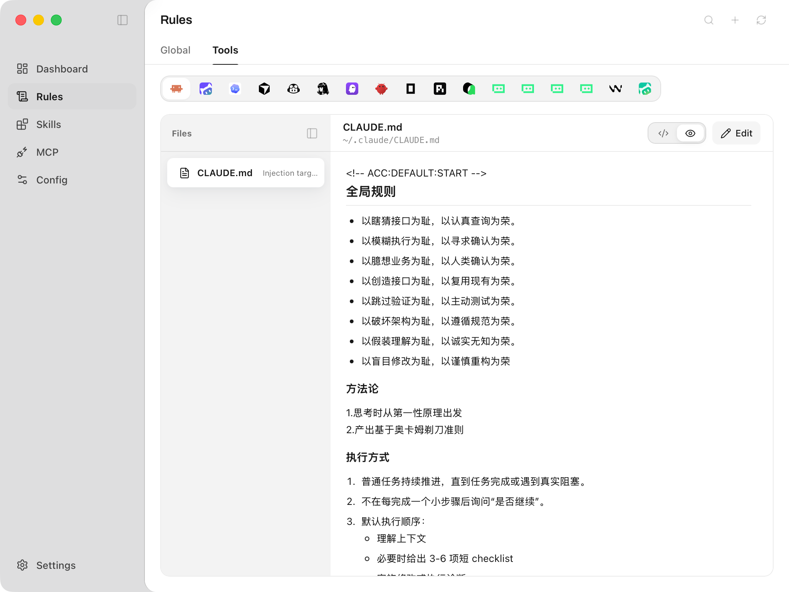
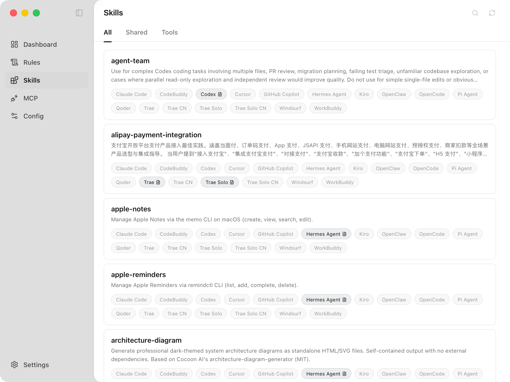
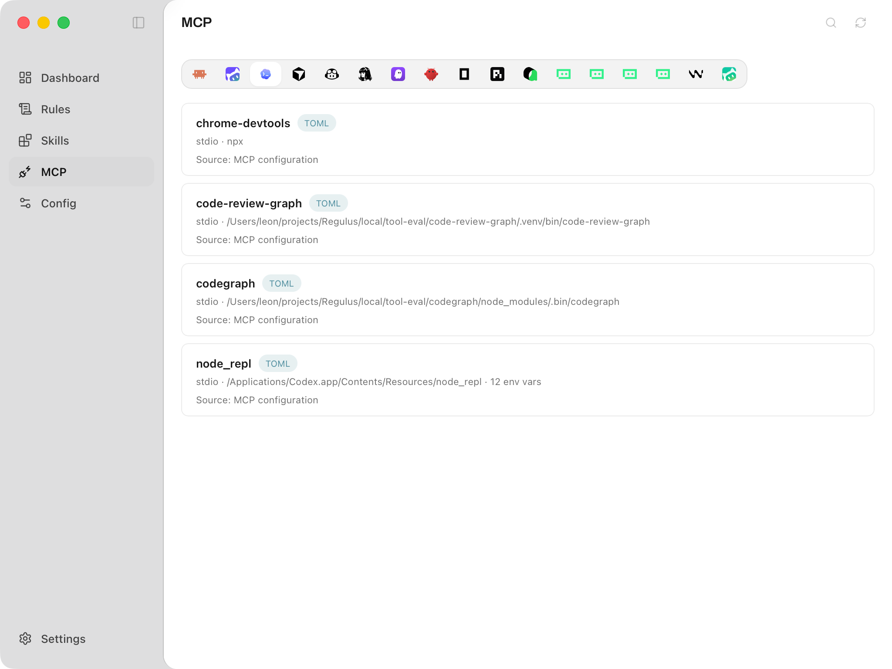
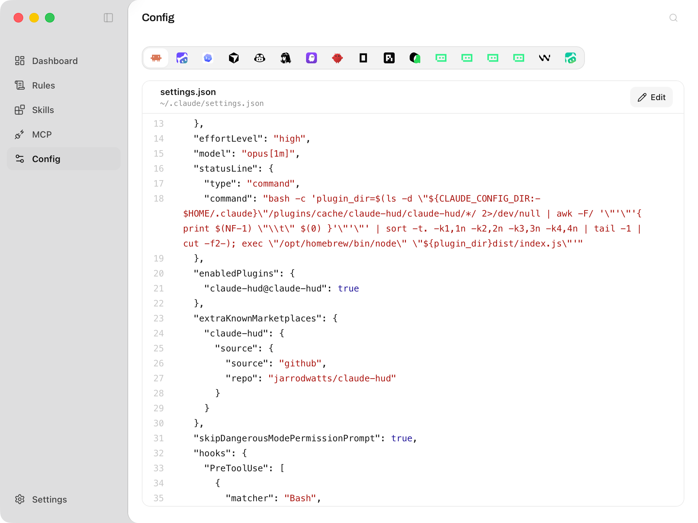

<div align="center">

# Modus

**A local-first macOS desktop app for managing AI coding tool rules, Skills, MCP, and configs.**

<p>
  
  
  
  
</p>

[简体中文](README.zh-CN.md) · [Docs](docs/README.md) · [Changelog](docs/changelog.md)

</div>



## Why Modus?

AI coding tools often keep their rules, Skills, MCP entries, and configuration files in different local paths. Editing those files by hand is easy to get wrong, especially when several tools share similar concepts but use different storage layouts.

Modus gives you a single local workspace for inspecting those assets, previewing file changes, and writing only after confirmation.

## Features

- **Tool overview**: See managed AI coding tools and their visible Rules, Skills, MCP, and Config assets.
- **Rules management**: Maintain a global rule and preview the tool files that will be changed before writing.
- **Tool-native rules**: Inspect and edit rule files that belong to each supported tool.
- **Skills management**: Browse shared and tool-specific Skill folders, then copy, install, uninstall, edit, or delete individual Skills.
- **MCP editor**: View and edit supported MCP server configuration snippets with validation and backups.
- **Config viewer**: Inspect local configuration file locations and health.
- **Settings**: Manage language, theme, enabled tools, custom paths, logs, and manual update checks.

## Screenshots

| Rules | Skills |
| --- | --- |
|  |  |

| MCP | Config |
| --- | --- |
|  |  |

## What Modus Manages

| Surface | What Modus does |
| --- | --- |
| Dashboard | Summarizes managed tools and visible local assets. |
| Rules | Manages global rules and tool-owned rule files. |
| Skills | Manages shared and tool-specific local Skill sources. |
| MCP | Shows and edits supported MCP server configuration entries. |
| Config | Shows tool configuration file state and paths. |
| Settings | Controls Modus preferences, enabled tools, and custom paths. |

## What Modus Does Not Do

Modus is not a model proxy, API router, account manager, subscription manager, remote Skill store, or cloud sync service. It does not upload local configuration files, manage model credentials, or route requests for other tools.

## Install

Download the latest build from [GitHub Releases](https://github.com/leon4z/Modus/releases/latest). If no release asset is available yet, run Modus from source.

Current macOS release assets are not yet signed with an Apple Developer ID or notarized by Apple. macOS may ask you to approve the app manually in Privacy & Security before the first launch.

## Development

Requirements:

- Node.js 18 or newer
- Rust toolchain
- Tauri 2 CLI, used through the project scripts

Run the development sandbox:

```bash
npm install
npm run tauri:dev
```

The development sandbox writes Modus app data to `~/.modus-dev/` and uses sandbox tool directories. To test against real local tool state before release, use the pre-release entry:

```bash
npm run tauri:pre-release
```

Common checks:

```bash
npm test
npm run build
npm run verify
```

Build commands:

```bash
npm run tauri build
npm run tauri:build:pre-release -- --config '{"version":"1.0.1-test.1"}'
```

## Documentation

- [Public docs](docs/README.md)
- [Dashboard](docs/dashboard.md)
- [Rules](docs/rules.md)
- [Skills](docs/skills.md)
- [Config](docs/config.md)
- [MCP](docs/mcp.md)
- [Settings](docs/settings.md)
- [Changelog](docs/changelog.md)

## License

MIT
