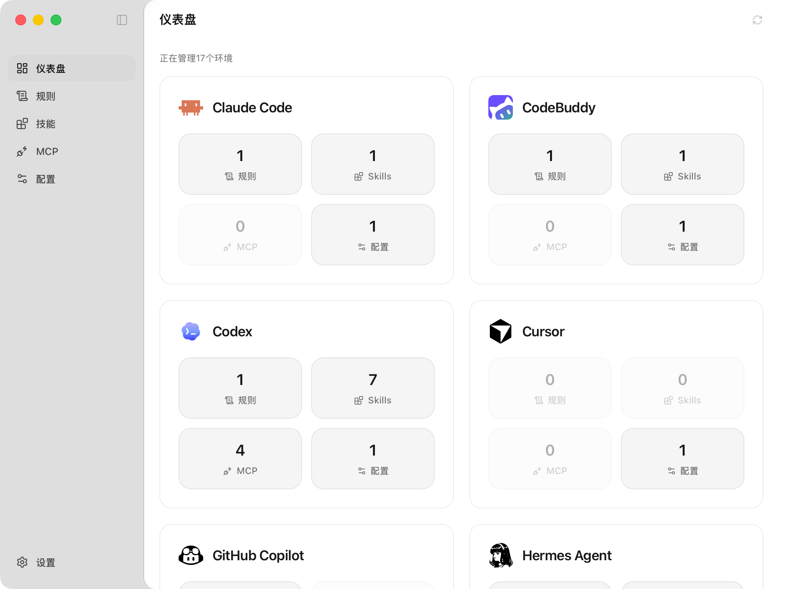
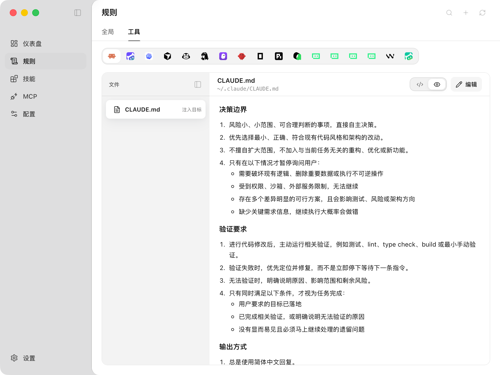
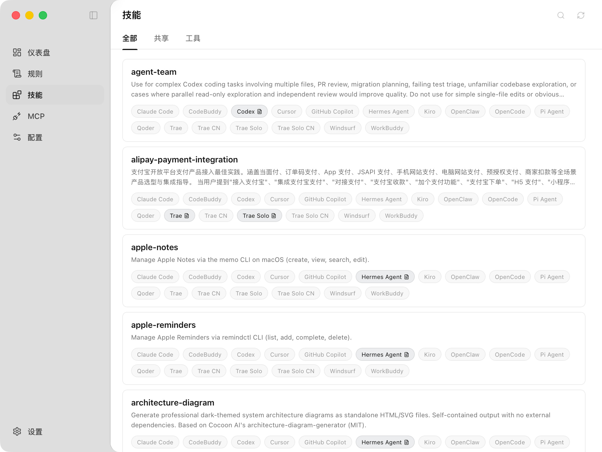
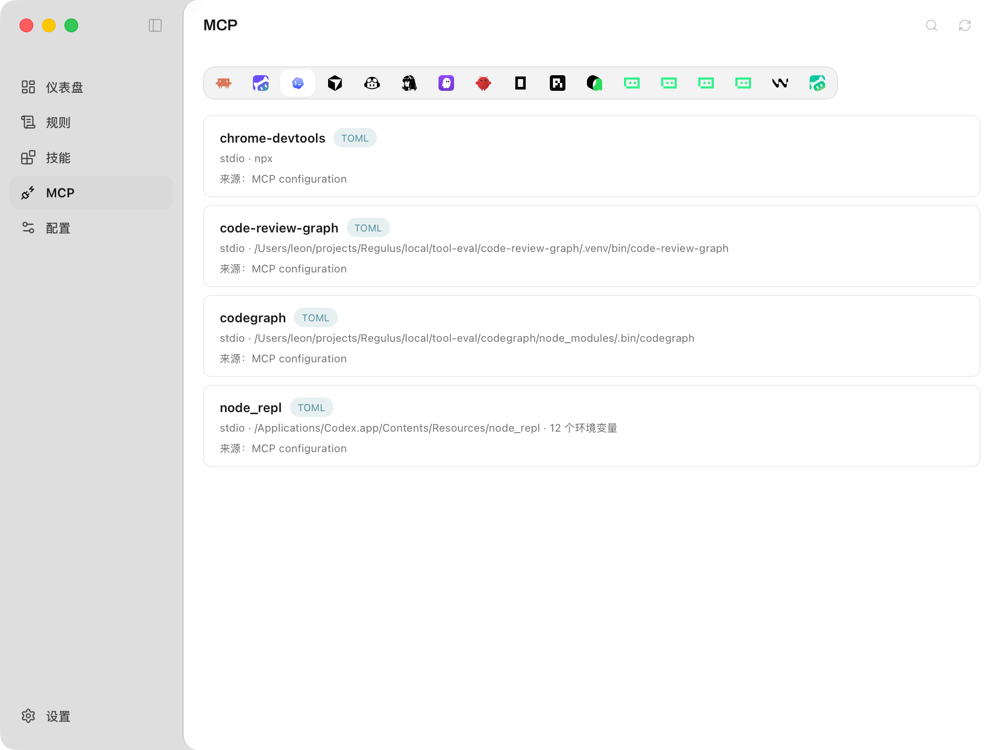
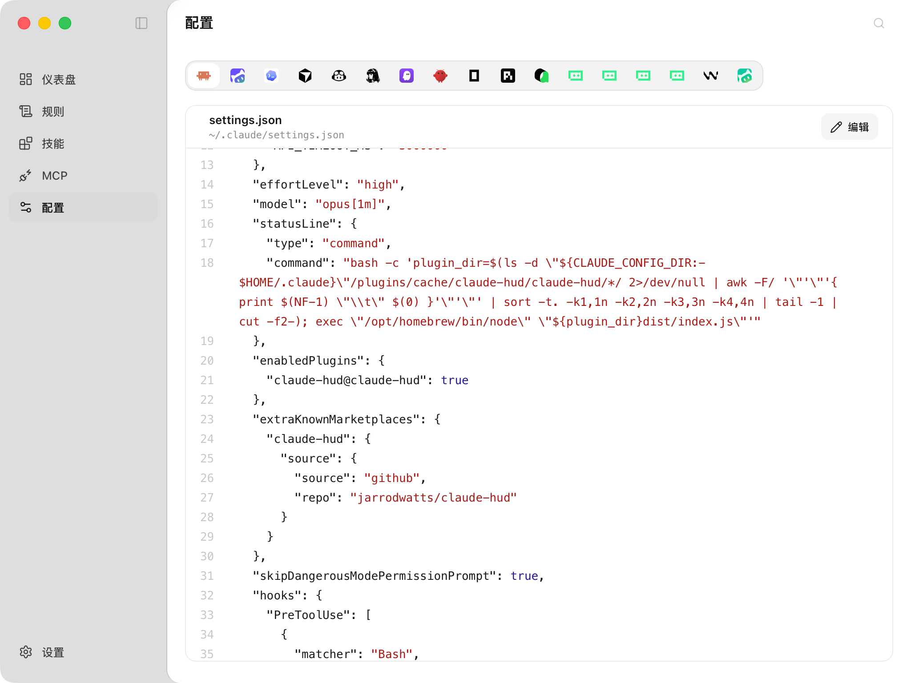

<div align="center">

# Modus

**本地优先的 macOS 桌面应用，用来管理 AI 编程工具的规则、技能、MCP 和配置。**

<p>
  
  
  
  
</p>

[English](README.md) · [文档](docs/README.md) · [更新日志](docs/changelog.md)

</div>



## 为什么需要 Modus？

AI 编程工具通常会把规则、技能、MCP 条目和配置文件放在不同的本机路径里。一个规则在某个 Agent 里打磨成熟后，往往还要在其它工具里重复编辑；一个 Skill 能不能被某个工具识别，也经常要去翻目录结构或文档确认。

Modus 提供一个本地工作台，让这些本机资产变得可见、可复用、可审计。你可以在统一界面里管理规则、Skill、MCP 和配置文件，并在写入前先确认实际文件变更。

每个工具的支持范围都基于对应工具的官方文档，并结合真实 macOS 本机环境中的实测结果整理而来；当官方文档没有完整说明规则、Skill、MCP 或配置在本机磁盘上的来源时，以本机验证记录补足。Modus 按能力矩阵判断支持范围，所以某个工具可能已经支持发现或只读查看，但某个写入动作仍会保持未验证或不可用。

## 核心亮点

- **统一注入全局规则**：维护一份共享规则，并同步到支持的工具，让不同 Agent 在一致的工作约束下运行，避免在多个工具里重复复制和修改同一套规则。
- **看清 Skill 是否可用**：Skill 卡片会展示各工具的可用状态，方便判断某个 Skill 当前能不能被对应工具使用。
- **兼容共享 Skill 和工具目录 Skill**：Modus 会区分支持用户级 Skill 的工具和只支持工具目录 Skill 的工具，并兼容 `skill.sh` 社区常见的安装方式。共享 Skill 可以通过软链接安装到工具目录，保留一个可维护的来源。
- **跨工具复用打磨过的 Skill**：在某个工具里长期打磨出来的 Skill，可以直接复制到其它工具，减少重复整理。
- **按需卸载或删除 Skill**：Skill 太多会浪费上下文。暂时不用的 Skill 可以从某个工具卸载，也可以在确认后删除对应来源。
- **统一编辑 dotfile 配置**：许多 Agent 配置分散在本机 dotfile 目录里，通常要用命令行或 IDE 修改。Modus 把支持的配置入口集中展示，并提供统一编辑体验。
- **文件变更先审计再写入**：会创建、修改、删除或链接哪些文件，都会先预览和确认，降低误删自己打磨过的规则或 Skill 的风险。

## 截图

| 规则 | 技能 |
| --- | --- |
|  |  |

| MCP | 配置 |
| --- | --- |
|  |  |

## Modus 管理什么？

| 页面 | 说明 |
| --- | --- |
| 仪表盘 | 汇总已管理工具和可见的本地资产。 |
| 规则 | 管理全局规则和工具自己的规则文件。 |
| 技能 | 管理共享目录和工具目录里的本地技能来源。 |
| MCP | 查看和编辑支持的 MCP Server 配置条目。 |
| 配置 | 查看工具配置文件状态和路径。 |
| 设置 | 控制 Modus 偏好、启用工具和自定义路径。 |

## 支持的工具

当前已完成验证并接入的内置工具包括：

- Claude Code
- Codex
- CodeBuddy
- Cursor
- GitHub Copilot
- Hermes Agent
- Kiro
- OpenClaw
- OpenCode
- Pi Agent
- Qoder
- Trae
- Trae CN
- Trae Solo
- Trae Solo CN
- Windsurf
- WorkBuddy

设置页也可以按本机路径登记自定义工具。自定义工具属于用户配置项，不等同于上面的内置支持清单。

## Modus 不做什么？

Modus 不是模型代理、API 路由器、账号管理器、订阅管理器、远程技能商店或云同步服务。它不会上传本机配置文件，不管理模型凭据，也不替其它工具转发请求。

## 安装

从 [GitHub Releases](https://github.com/leon4z/Modus/releases/latest) 下载最新构建。如果暂时没有可用的 release 资产，请先从源码运行。

当前 macOS release 资产暂未使用 Apple Developer ID 签名，也暂未经过 Apple 公证。首次启动时，macOS 可能会要求你在“隐私与安全性”中手动允许打开。

## 开发

前提条件：

- Node.js 18 或更新版本
- Rust toolchain
- Tauri 2 CLI，通过项目脚本调用

运行开发沙盒：

```bash
npm install
npm run tauri:dev
```

开发沙盒会把 Modus 应用数据写入 `~/.modus-dev/`，并使用沙盒工具目录。发布前如果需要验证真实本机工具状态，使用预发布入口：

```bash
npm run tauri:pre-release
```

常用检查：

```bash
npm test
npm run build
npm run verify
```

构建命令：

```bash
npm run tauri build
npm run tauri:build:pre-release -- --config '{"version":"1.0.1-test.1"}'
```

## 文档

- [公开文档](docs/README.md)
- [仪表盘](docs/dashboard.md)
- [规则](docs/rules.md)
- [技能](docs/skills.md)
- [配置](docs/config.md)
- [MCP](docs/mcp.md)
- [设置](docs/settings.md)
- [更新日志](docs/changelog.md)

## License

MIT
